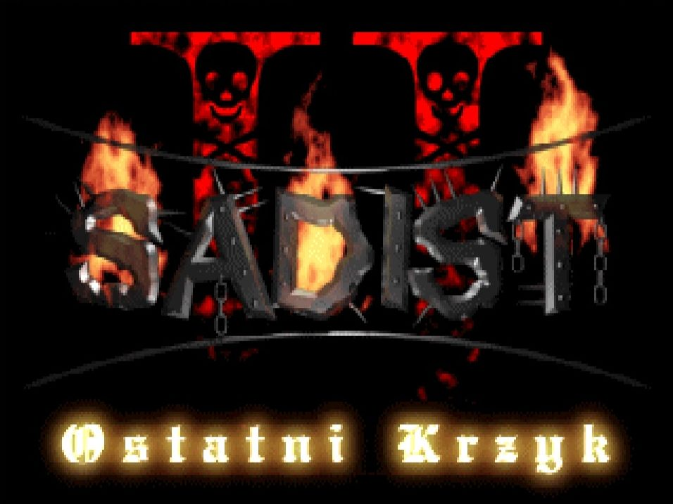

# Sadist 2 - Ostatni krzyk 

(eng. Sadist 2 - The Last Scream)

Sadist 2 - An old classic DOS game from 2000. 
The successor of Sadist.

Created by Grzegorz Drozd, long time ago...

# Website

The 'Sadist 2' website is available at https://gadz.pl/sadist-2
You can download working game there, find some videos, screenshots, descriptions etc.

A video gameplay is here: https://www.youtube.com/watch?v=MA6PZX7lKpY

# Compilation

Sadist 2 is created in Turbo Pascal 7.0 by Borland International Inc.
The best compiler to compile souces is TP or Borland Pascal. It's almost the same. There is a free Borland Pascal Compiler to download in the internet, so if you need it, you'll find it. I cannot distribute it because it's not my software.

All needed source files should be included in this repositiory. Main file to start is `sadist2.pas`. There are also a few additional small tools in other files but most of `pas` files are the units of Sadist game.

# The code

This is a Polish game. I was creating it when I was young and learning to code, so this code is not top quality. Almost all variable and type names are Polish, so it could be hard to understand for foreigners. You'll see also there is a big mess in the code, ugly formatting etc. Sorry, it was my fault. You may believe me, but today I do code reviews to other programmers at work and I don't allow anyone to type like this what is here! BUT! All of this shows how a man learns and develop his skills.

The code will be mostly automatically formatted to be more readable. For now, it is completely the same as it was more than 20 years ago.

# The purpose of this repositiory

Do what do you want with this code. Maybe you'll learn, maybe have fun. Maybe you'll fix something or change. The only thing I wouldn't like you to do is changing the credits for my game and release it anywhere. Please, keep in mind, it was my game and I sacrificed many months of work on it. And it all was always free. I deserve credit for this game and this code. Even if it's not the best quality. Thanks.

Grzegorz "GAD" Drozd, vel GadZombie
